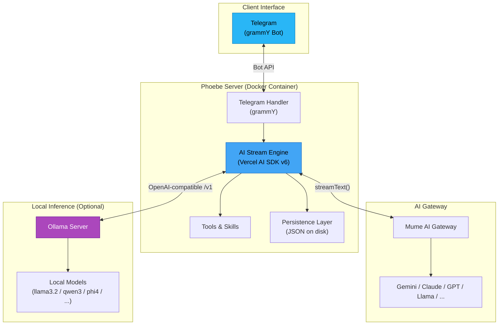
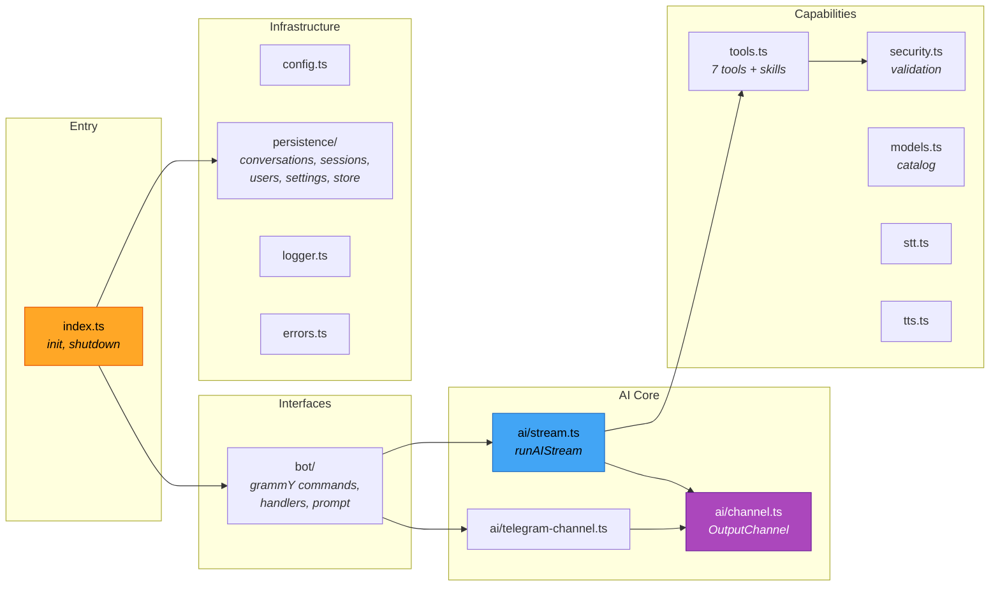
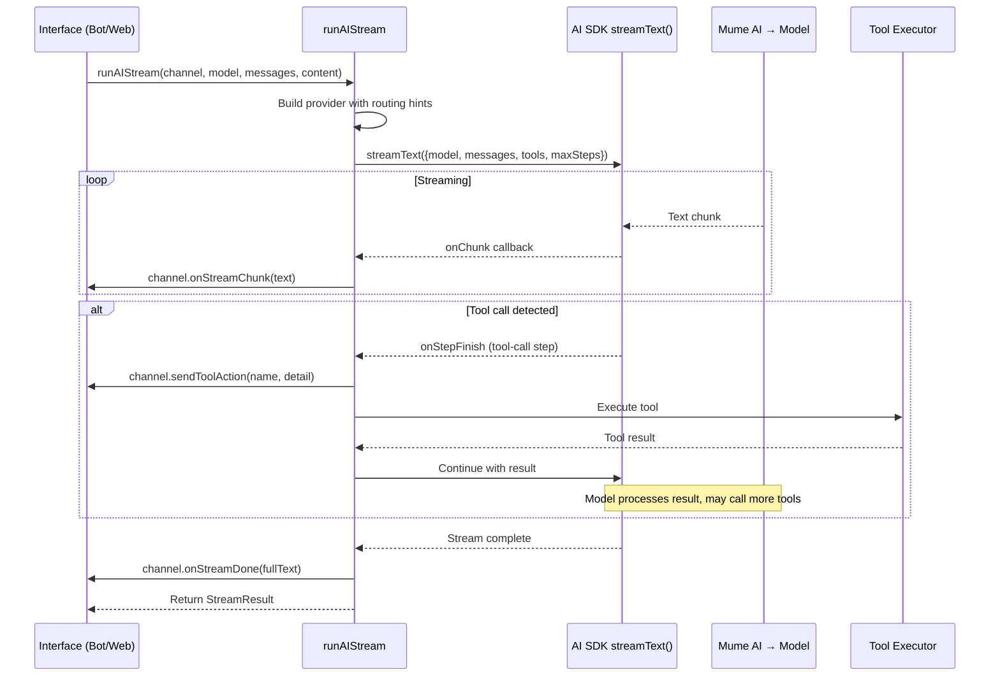
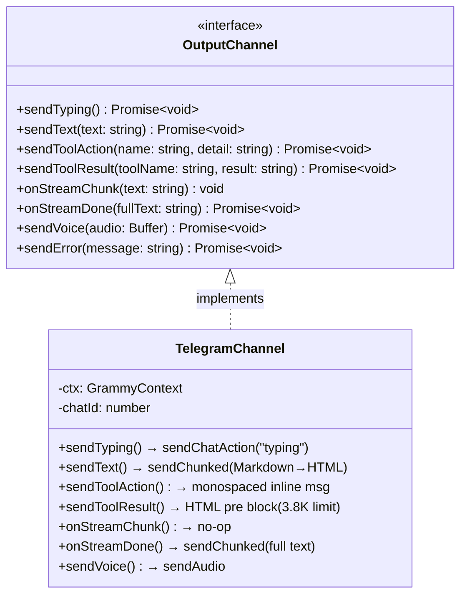
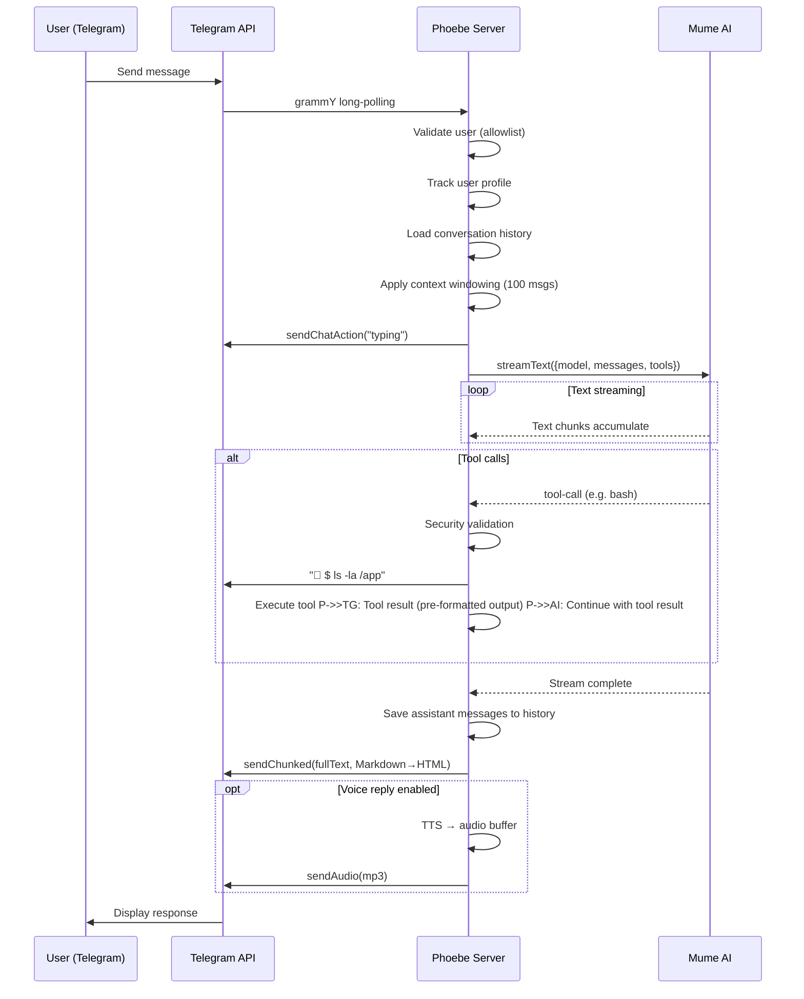
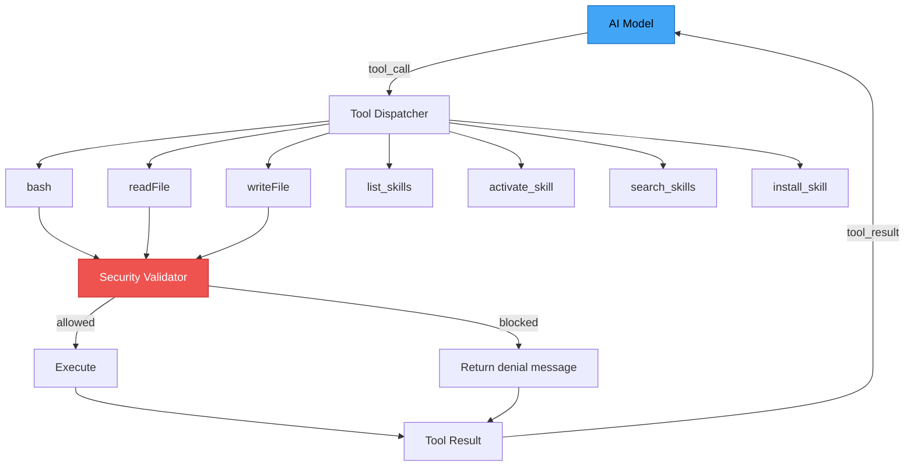
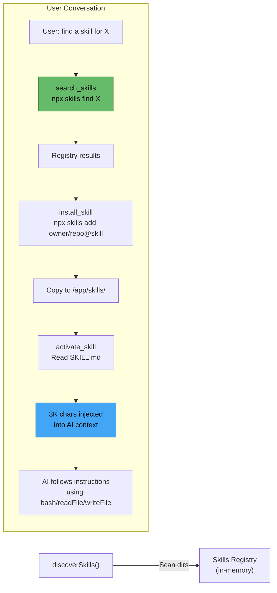
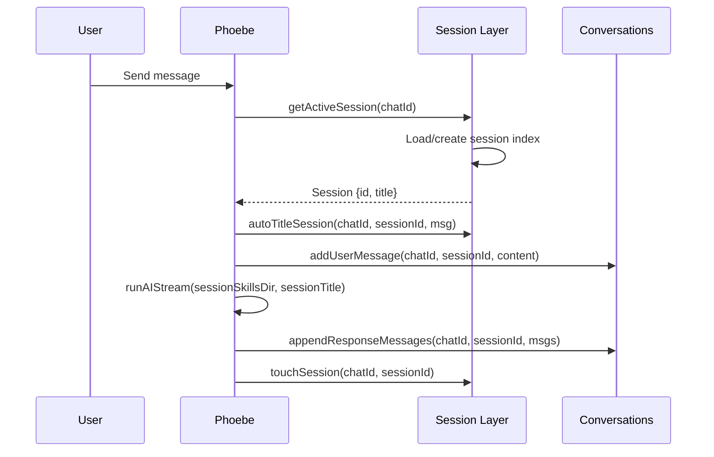
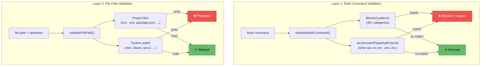
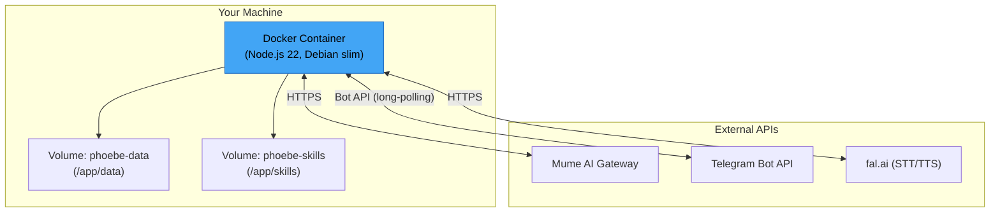

# Architecture

> Deep dive into Phoebe's internals — how every component connects, communicates, and streams.

This document covers the system design of Phoebe's AI agent, delivered through **Telegram** via [grammY](https://grammy.dev). The architecture is built around an `OutputChannel` abstraction that makes it straightforward to add new delivery channels (WhatsApp, Discord, Slack) without touching the AI core.

---

## Table of Contents

- [High-Level Overview](#high-level-overview)
- [Core Concepts](#core-concepts)
- [Module Map](#module-map)
- [AI Streaming Engine](#ai-streaming-engine)
- [OutputChannel Abstraction](#outputchannel-abstraction)
- [Message Flow — Telegram](#message-flow--telegram)
- [Tool System](#tool-system)
- [Agent Skills Lifecycle](#agent-skills-lifecycle)
- [Conversation Memory & Windowing](#conversation-memory--windowing)
- [Session Management](#session-management)
- [Security Architecture](#security-architecture)
- [Model Catalog](#model-catalog)
- [Persistence Layer](#persistence-layer)
- [Error Handling](#error-handling)
- [Deployment Topology](#deployment-topology)
- [Tech Stack Summary](#tech-stack-summary)

---

## High-Level Overview



**Key design principle:** The AI engine knows nothing about Telegram. It talks to an `OutputChannel` interface. This lets us add new delivery channels (WhatsApp, Discord, Slack, CLI, etc.) without touching the AI core.

---

## Core Concepts

| Concept               | What it means                                                                                                                                 |
| --------------------- | --------------------------------------------------------------------------------------------------------------------------------------------- |
| **OutputChannel**     | Interface that decouples the AI engine from message delivery. Each interface (Telegram, future WhatsApp/Discord/Slack) implements it.         |
| **runAIStream**       | The central function. Takes an OutputChannel, model ID, context, and user input. Orchestrates streaming, tool calls, and response collection. |
| **Context Windowing** | Smart truncation of conversation history — recent messages keep full detail, older tool results are compressed.                               |
| **Agent Skills**      | Markdown instruction files loaded into context on demand. The AI discovers, installs, and follows them autonomously.                          |

---

## Module Map



### File Inventory (~3,800 lines of TypeScript)

| File                               | Lines | Role                                                        |
| ---------------------------------- | ----: | ----------------------------------------------------------- |
| `src/index.ts`                     |    92 | Entry point — env loading, init sequence, graceful shutdown |
| `src/config.ts`                    |    35 | Environment variable resolution with defaults               |
| `src/logger.ts`                    |   331 | Zero-dependency ANSI structured logging                     |
| `src/models.ts`                    |   452 | Model catalog — fetch, cache, search, capabilities          |
| `src/tools.ts`                     |   520 | All 7 AI-callable tools + Agent Skills registry + bg cmds   |
| `src/security.ts`                  |   228 | Bash command validation + file path protection              |
| `src/stt.ts`                       |    88 | Speech-to-text via ElevenLabs Scribe V2 (fal.ai)            |
| `src/tts.ts`                       |    72 | Text-to-speech via ElevenLabs Turbo v2.5 (fal.ai)           |
| `src/errors.ts`                    |    21 | Error pattern → friendly message mapper                     |
| `src/ai/stream.ts`                 |   325 | Interface-agnostic AI streaming engine (session-aware)      |
| `src/ai/channel.ts`                |    30 | OutputChannel interface definition                          |
| `src/ai/telegram-channel.ts`       |    85 | Telegram OutputChannel implementation                       |
| `src/bot/instance.ts`              |   271 | Bot singleton, AI provider, Markdown→HTML, sendChunked      |
| `src/bot/commands.ts`              |   440 | All `/command` + `/session` handlers + callbacks            |
| `src/bot/handlers.ts`              |   270 | Text, photo, document, voice message handlers               |
| `src/bot/prompt.ts`                |    46 | System prompt builder (session-aware)                       |
| `src/persistence/store.ts`         |    26 | Low-level JSON read/write helpers                           |
| `src/persistence/conversations.ts` |   180 | Session-scoped conversation history + context windowing     |
| `src/persistence/sessions.ts`      |   294 | Multi-session CRUD, auto-title, migration, skill paths      |
| `src/persistence/settings.ts`      |   117 | Per-chat model, voice, voice-reply settings                 |
| `src/persistence/users.ts`         |    55 | User profile tracking                                       |

---

## AI Streaming Engine

The heart of Phoebe lives in `ai/stream.ts`. The `runAIStream()` function is completely interface-agnostic.

### Function Signature

```typescript
async function runAIStream(params: {
  channel: OutputChannel; // Where to deliver output
  modelId: string; // e.g. "anthropic/claude-sonnet-4.6"
  contextMessages: ModelMessage[]; // Conversation history (windowed)
  userContent: UserContent; // Text, images, files from the user
  tools: Record<string, Tool>; // Available tools
  maxSteps: number; // Tool call step limit
  abortSignal?: AbortSignal; // External cancellation
  sessionSkillsDir?: string; // Per-session skills directory
  sessionTitle?: string; // Session name for system prompt
}): Promise<StreamResult>;
```

### Lifecycle



### Key Behaviours

| Behaviour               | Detail                                                                                   |
| ----------------------- | ---------------------------------------------------------------------------------------- |
| **Timeout**             | 30-minute hard limit per request. AbortController fires, partial text returned.          |
| **Response collection** | 30-second grace period after stream ends to collect final `responseMessages`.            |
| **Per-chat abort**      | New messages from the same chat abort in-flight requests via shared AbortController.     |
| **Provider routing**    | Extracts provider slug from model ID → `order: [slug], allow_fallbacks: true`.           |
| **Step limit**          | Configurable `MAX_STEPS` (default 25). Uses AI SDK's `stepCountIs()` stopping condition. |
| **Error recovery**      | Catches all errors, sends user-friendly message via channel, returns partial result.     |

---

## OutputChannel Abstraction

The interface boundary between the AI engine and message delivery.



### Why This Matters

Adding a new interface (e.g. WhatsApp, Discord, Slack) requires only:

1. Implement `OutputChannel` (~70 lines)
2. Wire it to the input source
3. Call `runAIStream()` with your channel

No changes to the AI engine, tools, or security layer.

---

## Message Flow — Telegram



### Telegram-Specific Details

- **No progressive message updates** — Telegram's edit rate limits make real-time streaming impractical. Instead, typing indicators are sent every 4 seconds while the AI works, and the full response is delivered at once.
- **Smart message splitting** — `sendChunked()` splits at paragraph → line → word boundaries, respecting Telegram's 4,096-character limit per message.
- **Markdown → HTML** — Converts AI markdown (bold, italic, code, links) to Telegram-compatible HTML.
- **Tool transparency** — Each tool call is shown as an inline monospaced message (e.g. `$ git status`) so users see exactly what the AI is doing. Tool results are also sent as pre-formatted HTML output.
- **Media handling** — Photos, documents, and voice messages are downloaded (with 3 retries) and forwarded to the AI as multimodal content.

---

## Tool System

All tools are defined in `tools.ts` using the Vercel AI SDK `tool()` helper with Zod schemas.

### Tool Definitions

| #   | Tool             | Parameters                                            | Security                          | Output                                                      |
| --- | ---------------- | ----------------------------------------------------- | --------------------------------- | ----------------------------------------------------------- |
| 1   | `bash`           | `command: string`, `timeout?: number`, `cwd?: string` | `validateBashCommand()`           | stdout + stderr + exit code (50K limit). Background: PID + log path |
| 2   | `readFile`       | `filePath: string`                                    | `validateFilePath(path, "read")`  | File contents (50K char limit)               |
| 3   | `writeFile`      | `filePath: string`, `content: string`                 | `validateFilePath(path, "write")` | Success/error message                        |
| 4   | `list_skills`    | `filter?: string`                                     | None                              | Skill names + descriptions (session-scoped)  |
| 5   | `activate_skill` | `name: string`                                        | None                              | SKILL.md content (3K char limit)             |
| 6   | `search_skills`  | `query: string`                                       | None                              | Registry search results                      |
| 7   | `install_skill`  | `source: string`                                      | None                              | Install confirmation (to session skills dir) |

### Execution Flow



---

## Agent Skills Lifecycle



### Skill Discovery

On startup and on each `list_skills` call, Phoebe scans (in priority order):

1. **Session-specific** (`skills/sessions/<sessionId>/`) — highest priority, isolated per session
2. **Shared** (`SKILLS_DIR` / `/app/skills/`) — available to all sessions
3. **Global** (`~/.agents/skills/`) — npx default

The active session's skills directory is set per-request via `setSessionSkillsDir()` before any tool executes, and cleared after the request completes.

Each subdirectory with a `SKILL.md` containing YAML frontmatter (`name`, `description`) is registered.

### Skill Activation

When the AI calls `activate_skill(name)`, the SKILL.md file is read (max 3,000 chars) and returned as a tool result. The model then has instructions in context and follows them using the other tools. Skills are **lazy** — they consume no resources until activated.

---

## Conversation Memory & Windowing

Phoebe stores full `ModelMessage` objects including tool-call and tool-result parts. Conversations are **session-scoped** — each session has its own isolated history.

### Storage

| Constant                 |  Value | Purpose                                              |
| ------------------------ | -----: | ---------------------------------------------------- |
| `MAX_DISK_MESSAGES`      |    500 | Maximum messages persisted to disk per session        |
| `MAX_CONTEXT_MESSAGES`   |    100 | Maximum messages sent to the model as context         |
| `RECENT_FULL_TOOLS`      |     30 | Last N messages keep full tool result text            |
| `MAX_TOOL_RESULT_LENGTH` | 10,000 | Truncation limit for older tool results               |

### Windowing Logic

```
Full conversation on disk (up to 500 messages)
         │
         ▼
Take last 100 messages for context
         │
         ▼
Messages 1-70:  Tool results truncated to 10K chars
Messages 71-100: Full tool results preserved
         │
         ▼
Send to model with system prompt
```

### Content Sanitisation

When saving to disk, binary content is replaced with text placeholders:

- Images → `[image]`
- Files → `[file: filename.ext]`

This keeps conversation files JSON-serializable and reasonably sized.

---

## Session Management

Phoebe supports multiple named conversation sessions per chat. Each session has isolated conversation history and skills.

### Data Model

```typescript
interface Session {
  id: string; // 8-char hex (crypto.randomBytes(4))
  title: string; // Auto-generated or user-set
  createdAt: string; // ISO 8601
  updatedAt: string; // ISO 8601
}

interface SessionIndex {
  activeId: string; // Currently active session ID
  sessions: Session[]; // All sessions for this chat
}
```

### Storage

- **Session index** — `data/sessions/<chatId>.json` — maps chat → sessions + active ID
- **Conversations** — `data/conversations/<chatId>_<sessionId>.json` — history per session
- **Skills** — `skills/sessions/<sessionId>/` — isolated skills per session

### Auto-Titling

Sessions with default names ("Session N" or "Default") are automatically titled when the first user message arrives. The title is the first 50 characters of the message, truncated at a word boundary.

### Legacy Migration

On first access, if a legacy `conversations/<chatId>.json` file exists (pre-session era), it's renamed to `conversations/<chatId>_<defaultSessionId>.json` and a session index is created with a "Default" session.

### Lifecycle



---

## Security Architecture

### Two-Layer Validation



### Blocked Bash Command Categories

| Category               | Patterns                                                                               | Rationale                            |
| ---------------------- | -------------------------------------------------------------------------------------- | ------------------------------------ |
| Destructive filesystem | `rm -rf /`, recursive delete on `/`, `~`, `../`                                        | Prevent data loss                    |
| Filesystem format      | `mkfs`                                                                                 | Prevent storage destruction          |
| Raw disk writes        | `dd … of=/dev/`                                                                        | Prevent disk corruption              |
| System control         | `shutdown`, `reboot`, `poweroff`, `halt`, `init 0/6`, `systemctl poweroff/reboot/halt` | Prevent host disruption              |
| Fork bombs             | `:(){ :\|:& };:`                                                                       | Prevent resource exhaustion          |
| Infinite loops         | `while true … do … done`                                                               | Prevent resource exhaustion          |
| Process management     | `pm2 delete/kill/stop all/phoebe`                                                      | Prevent self-destruction             |
| Privilege escalation   | `chmod 777`, `chmod +s`, `passwd`, `usermod`, `useradd`, `visudo`                      | Prevent privilege abuse              |
| Reverse shells         | `nc -l`, `ncat -l`                                                                     | Prevent network exploitation         |
| Remote code exec       | `curl/wget … \| sh/bash`                                                               | Prevent remote code injection        |
| Secret exfiltration    | `cat .env`, `cat /etc/shadow`, `cat id_rsa`                                            | Prevent credential leak              |
| Source code editing    | `sed/awk/perl -i … src/`, `vim/nano/vi/emacs … src/`                                   | Prevent self-modification            |
| Destructive git        | `git push`, `git reset --hard`, `git checkout --`                                      | Prevent repo corruption              |
| Cron persistence       | `crontab -r/-e`                                                                        | Prevent scheduled attack persistence |
| Kernel modules         | `insmod`, `rmmod`, `modprobe`                                                          | Prevent kernel manipulation          |
| Firewall               | `iptables -A/D/I`, `ufw allow/deny/delete/reset`                                       | Prevent network rule changes         |

### Protected File Paths

**Write-protected project files:**
`src/`, `package.json`, `pnpm-lock.yaml`, `tsconfig.json`, `.env`, `ecosystem.config.cjs`, `ARCHITECTURE.md`, `README.md`, `.git/`, `node_modules/`

**Write-protected system paths:**
`/etc/`, `/boot/`, `/usr/`, `/sbin/`, `/bin/`, `/lib/`, `/var/log/`, `/proc/`, `/sys/`

---

## Model Catalog

Phoebe supports two model sources: the Mume AI cloud gateway and local Ollama models. Both catalogs are fetched and cached independently.

### Features

- **Dual sources** — cloud models from Mume AI + local models from Ollama (when `OLLAMA_BASE_URL` is set)
- **Fetch & cache** — cloud catalog saved to `openrouter-models.json`, Ollama catalog to `ollama-models.json`
- **Unified catalog** — both sources are merged for queries, browsing, and search
- **Ollama prefix** — local models are namespaced as `ollama/<model>` (e.g. `ollama/llama3.2`)
- **Search** — keyword search across model names and IDs
- **Ollama filter** — `/models ollama` shows only local Ollama models
- **Capabilities** — detects: tools, vision, audio input/output, image output, reasoning, structured output, web search, video input, file input
- **Pagination** — inline keyboard navigation in Telegram (10 models per page)
- **Price formatting** — displays cost per million tokens

### Provider Routing

When the user sends a message, `resolveProvider(modelId)` in `instance.ts` routes to the correct backend:

- Models starting with `ollama/` → local Ollama server via `@ai-sdk/openai-compatible` (OpenAI-compatible `/v1` endpoint)
- All other models → Mume AI gateway via `@openrouter/ai-sdk-provider`

### Capability Detection

Capabilities are inferred from model metadata:

| Capability        | Detection                                             |
| ----------------- | ----------------------------------------------------- |
| Tools             | `supported_parameters` includes `"tools"`             |
| Vision            | `input_modalities` includes `"image"`                 |
| Audio input       | `input_modalities` includes `"audio"`                 |
| Audio output      | `output_modalities` includes `"audio"`                |
| Image output      | `output_modalities` includes `"image"`                |
| Reasoning         | `supported_parameters` includes `"reasoning"`         |
| Structured output | `supported_parameters` includes `"structured_output"` |
| Web search        | `supported_parameters` includes `"web_search"`        |

---

## Persistence Layer

All state is stored as JSON files on disk in `DATA_DIR` (mounted as a Docker volume).

### Files

| File                                     | Structure                 | Purpose                                  |
| ---------------------------------------- | ------------------------- | ---------------------------------------- |
| `users.json`                             | `UserProfile[]`           | User ID, name, username, first/last seen |
| `models.json`                            | `{ chatId: modelId }`     | Per-chat model override                  |
| `voices.json`                            | `{ chatId: voiceName }`   | Per-chat TTS voice preference            |
| `voice-reply.json`                       | `{ chatId: boolean }`     | Per-chat voice reply toggle              |
| `openrouter-models.json`                 | `AIModel[]`               | Cached cloud model catalog (Mume AI)     |
| `ollama-models.json`                     | `AIModel[]`               | Cached local model catalog (Ollama)      |
| `sessions/<chatId>.json`                 | `SessionIndex`            | Session list + active session per chat   |
| `conversations/<chatId>_<sid>.json`      | `ModelMessage[]`          | Conversation history per session (max 500) |

### Init Sequence

On startup, `index.ts` loads all persistence stores in order:

1. Ensure data directory exists (including `conversations/` and `sessions/` subdirs)
2. Load users, models, voices, voice-reply settings
3. Fetch/load model catalog
4. Discover installed skills
5. Start Telegram bot

Session indices are loaded lazily on first access per chat (not at startup).

### Graceful Shutdown

On `SIGINT` / `SIGTERM`:

1. Call `persistAll()` — writes all in-memory state to disk (conversations, session indices, settings, profiles)
2. Stop Telegram bot
3. Exit process

---

## Error Handling

### User-Friendly Error Messages

`errors.ts` maps common API error patterns to human-readable messages:

| Pattern                 | User sees                |
| ----------------------- | ------------------------ |
| HTTP 429                | Rate limit message       |
| HTTP 401                | Authentication error     |
| Timeout / ETIMEDOUT     | Timeout message          |
| ECONNREFUSED            | Connection error         |
| Context length exceeded | Context too long message |
| HTTP 500                | Server error message     |

### Stream Error Recovery

If an error occurs during streaming:

1. Partial text (if any) is preserved
2. Error is sent via `channel.sendError()`
3. `StreamResult` is returned with whatever was collected
4. Conversation history is still saved (including partial response)

---

## Deployment Topology



### Container Contents

The Docker image is built on `node:22-slim` with additional tools:

- `git`, `curl`, `wget`, `jq` — common utilities
- `python3`, `python3-pip` — for Python-based tasks
- `procps`, `htop` — process monitoring

### Resource Footprint

| Metric       | Typical value   |
| ------------ | --------------- |
| Startup time | < 3 seconds     |
| Memory (RSS) | ~130 MB         |
| Image size   | ~350 MB         |
| Disk (data)  | < 10 MB typical |

---

## Tech Stack Summary

| Component         | Technology                            | Version |
| ----------------- | ------------------------------------- | ------- |
| Runtime           | Node.js                               | 22      |
| Language          | TypeScript (strict, ESM)              | 5.8     |
| Execution         | tsx (no build step)                   | 4.19    |
| AI Engine         | Vercel AI SDK                         | 6.0     |
| AI Gateway        | Mume AI (@openrouter/ai-sdk-provider) | 2.2     |
| Local Models      | Ollama (@ai-sdk/openai-compatible)    | 2.0     |
| Telegram          | grammY                                | 1.35    |
| Schema Validation | Zod                                   | 3.25    |
| Env Loading       | dotenv                                | 17.3    |
| Container         | Docker + Docker Compose               | —       |
| STT/TTS           | ElevenLabs via fal.ai                 | —       |
